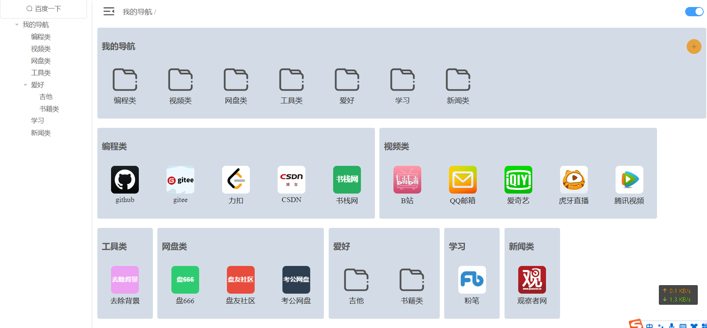

# front_navigation_self

## Project setup
```
npm install
```

### Compiles and hot-reloads for development
```
npm run serve
```

### Compiles and minifies for production
```
npm run build
```

### Customize configuration
See [Configuration Reference](https://cli.vuejs.org/config/).


2022-08-14 更改了一下样式




2022-09-18

1. 刷新保持 侧栏宽度
2. 刷新保持 是否展开子目录状态
3. 解决了 不展开子目录时，目录框不最大化问题
